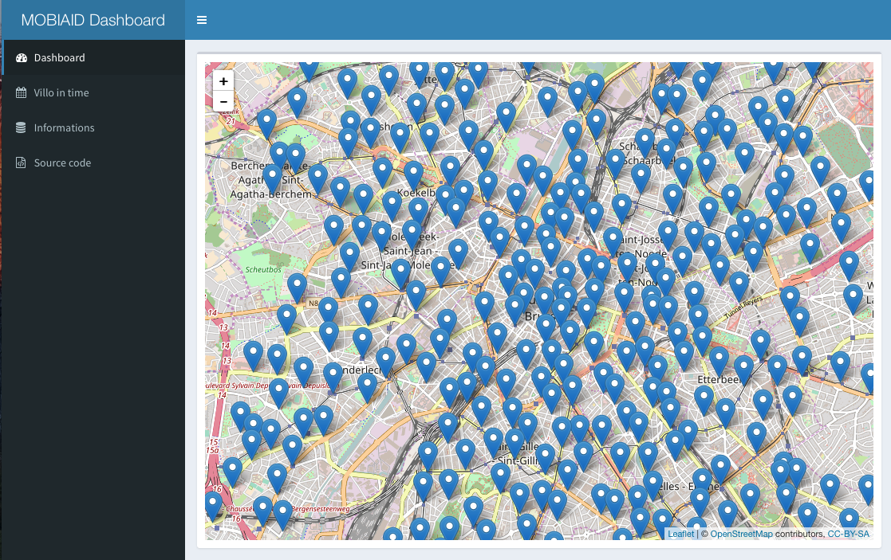
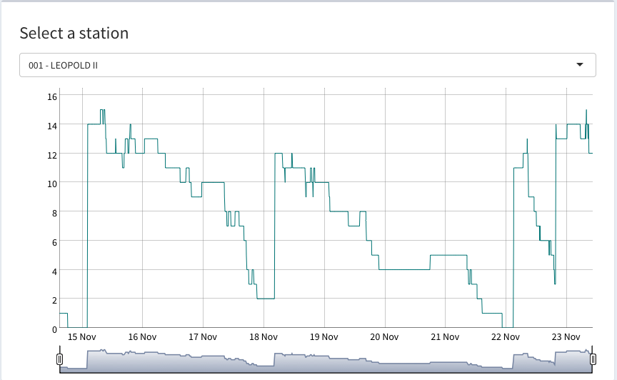
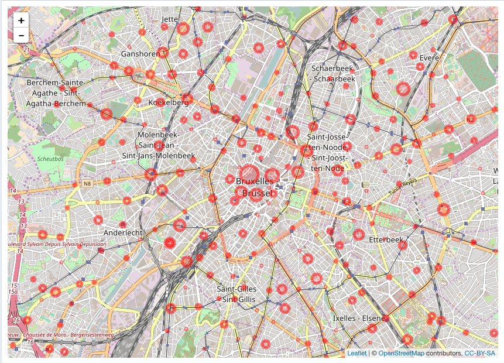

# MOBI-AID
Dashboard of bikeStations villo in brussels

## Install
Needing packages:  
  * shiny
  * shinydashboard
  * leaflet
  * RSQLite
  * dygraphs
  * xts

### Installation

    ./dynamicTable.R
    ./paserStations.R
    
    ./dashboard.R
 
And go to the localhost on your browser

## Presentation
This is a dashboard where you can see various informations about the using of the villo in Brussels.

### Geographical position
This leaflet map represent the positions of all the stations in Brussels

#### Graph of the using of bikes

### Villo in time
In this map, you can see the different frequencie of bikes in the time, you have a slider to select the historical of bikes

